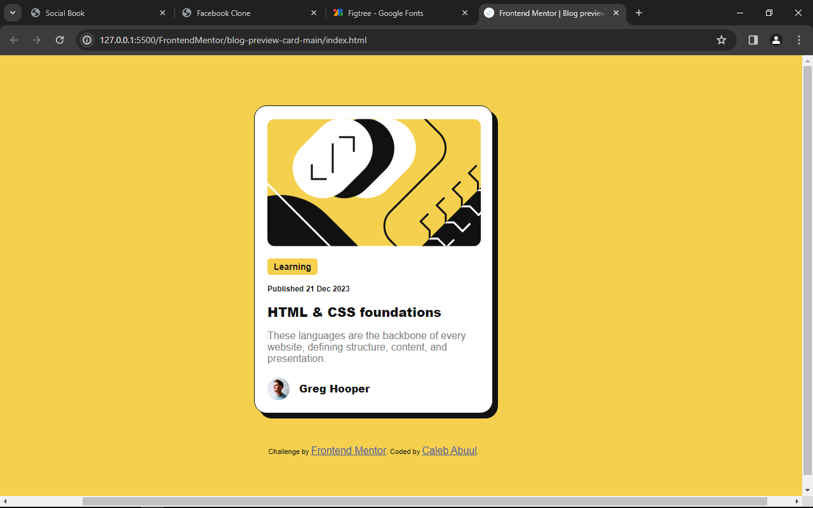
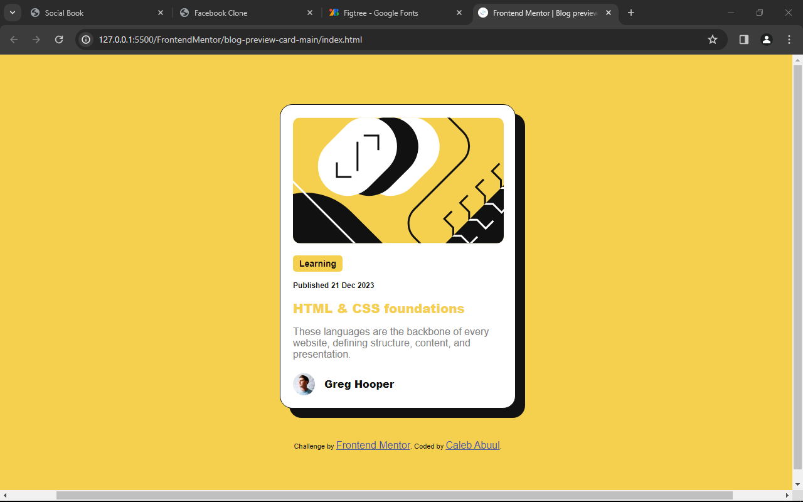
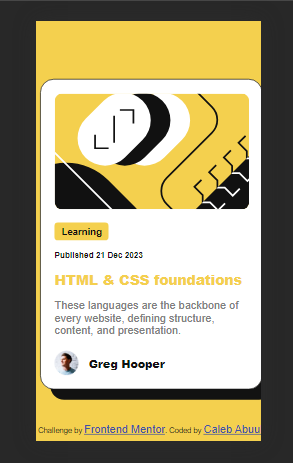

# Frontend Mentor - Blog preview card solution

This is a solution to the [Blog preview card challenge on Frontend Mentor](https://www.frontendmentor.io/challenges/blog-preview-card-ckPaj01IcS). Frontend Mentor challenges help you improve your coding skills by building realistic projects.

## Table of contents

- [Overview](#overview)
  - [The challenge](#the-challenge)
  - [Screenshot](#screenshot)
  - [Links](#links)
- [My process](#my-process)
  - [Built with](#built-with)
  - [What I learned](#what-i-learned)
  - [Continued development](#continued-development)
  - [Useful resources](#useful-resources)
- [Author](#author)
- [Acknowledgments](#acknowledgments)

**Note: Delete this note and update the table of contents based on what sections you keep.**

## Overview

### The challenge

Users should be able to:

- See hover and focus states for all interactive elements on the page

### Screenshot

To take the screenshots I used the `windows` + `Prnt Scrn` shortchut.

#### Desktop



#### Desktop - active



#### Mobile



### Links

- Solution URL: [Add solution URL here](https://your-solution-url.com)
- Live Site URL: [Add live site URL here](https://your-live-site-url.com)

## My process

### Built with

- Semantic HTML5 markup
- CSS custom properties
- Flexbox
- Mobile-first workflow

### What I learned

I learnt how to create responsive HTML elements with CSS without using `@media` queries. New CSS functions such as `calc()`, `min()`, `max()`, and `clamp()` makes it easy to write response CSS in a pretty easy way requiring less code. It literarily blew my mind 😄.

This gave me a new way to look at CSS.

```CSS
.container h1{
  font-size: clamp(1.25rem, 2vw, 1.3rem);
}
```

I also learnt how to write markdown in VSCode... 😸

If you want more help with writing markdown, I'd recommend checking out [The Markdown Guide](https://www.markdownguide.org/) to learn more.

### Continued development

### Useful resources

Just when I thought all was lost, these resources came to my rescue.

- [Web dev](<https://web.dev/articles/min-max-clamp#:~:text=Using%20the%20clamp()%20function,min(75ch%2C%2050%25)%3B%20>) - This helped me for setting responsive font-sizes, and `div` widths using `min()`, `max()`, and `clamp()` CSS functions. I really liked this pattern and will use it going forward.
- [Beatriz Caraballo](https://www.beatrizcaraballo.com/blog/responsive-text-squarespace) - This is an amazing article which helped me finally understand `clamp()` function. I'd recommend it to anyone still learning this concept.

## Author

- Github - [Caleb Abuul](https://github.com/Caleb-Abuul)
- Website - [Caleb](https://https://caleb-abuul.github.io/caleb/)
- Frontend Mentor - [@Caleb-Abuul](https://www.frontendmentor.io/profile/Caleb-Abuul)
- Twitter - [@CalebAbuul](https://www.twitter.com/CalebAbuul)
- LinkedIn - [@Caleb Abuul](www.linedin.com/in/caleb-abuul)

## Acknowledgments

A big thank you to [Kevin Powell](https://github.com/kevin-powell). He has been a great inspiration through his [YouTube Channel](https://youtube.com/@KevinPowell?si=Yhw2-yrCyeetnmys). His solution for the [Frontend Mentor Manage-landin-page project](https://youtu.be/h3bTwCqX4ns?si=P3J2UdvHI3udbL7u) helped me got a hang of how to approach challenges on frontend mentor. He has tons of videos spanning several topics in CSS on YouTube. Please do well to check him out [Kevin Powell](https://youtube.com/@KevinPowell?si=Yhw2-yrCyeetnmys)
